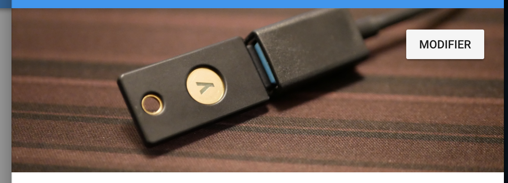

# vuetify-vuejs-firebase-card-media

[](https://www.npmjs.com/package/vuetify-vuejs-firebase-card-media)

A cover component with linked with your Firebase Storage project.



## Installation

```sh
npm install vuetify-vuejs-firebase-card-media --save
```

## Quick Usage

```vue
<template>
  <firebaseCardMedia
    path="YOUR/FOLDER/"
    :storage="getStorage()"
    previewImage="http://…"
    targetFileName="image.png"
    :limitToType="['image/png']"
    @onFileUpload="onUpload"
    @onFileDelete="onDelete"
    @onFileUploadError="onUploadError"
  />
</template>

<script>
  import Vue from 'vue';
  import firebaseCardMedia from 'vuetify-vuejs-firebase-card-media';
  Vue.use(firebaseCardMedia);

  export default {
    name: 'event',
    getStorage: function(){
      return firebase.storage();
    },
    onUpload: function(path){
      console.log(path);
    },
    onDelete: function(path){
      console.log(path);
    },
    onDelete: function(path){
      console.log(path);
    }
  }
</script>
```

## Full parameters usage

```vue
<template>
  <firebaseCardMedia
    path="YOUR/FOLDER/"
    :storage="getStorage()"
    previewImage="http://…"
    coverSize="200px"
    targetFileName="image.png"
    createBtnLabel="Choose the cover"
    modifyBtnLabel="Modify the cover"
    unsuportedMediaTypeLabel="Invalide file format"
    :limitToType="['image/png']"
    @onFileUpload="onUpload"
    @onFileDelete="onDelete"
    @onFileUploadError="onUploadError"
  />
</template>

<script>
  import Vue from 'vue';
  import firebaseCardMedia from 'vuetify-vuejs-firebase-card-media';
  Vue.use(firebaseCardMedia);

  export default {
    name: 'event',
    getStorage: function(){
      return firebase.storage();
    },
    onUpload: function(path){
      console.log(path);
    },
    onDelete: function(path){
      console.log(path);
    },
    onDelete: function(path){
      console.log(path);
    }
  }
</script>
```
